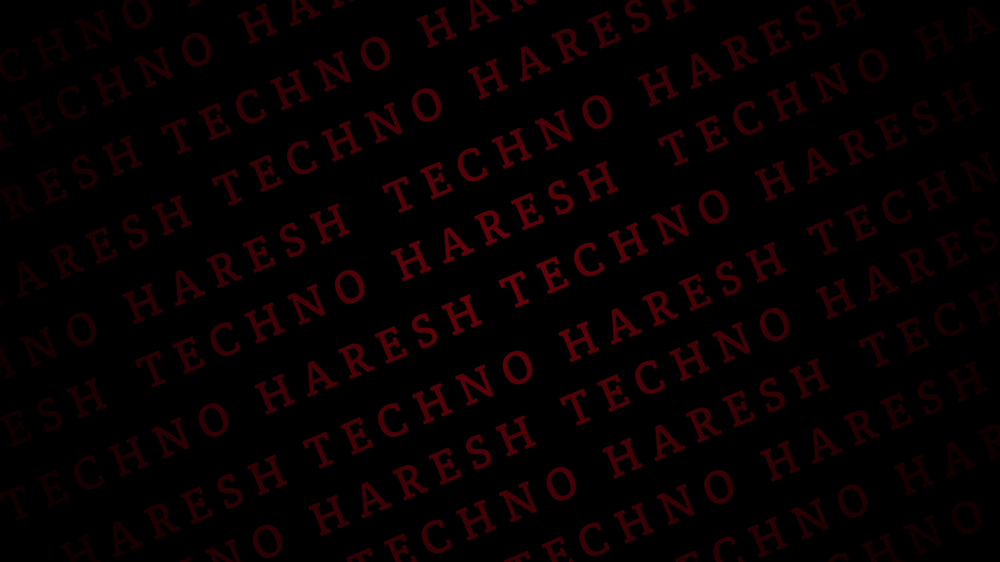

<h1 align="center">Hi 👋, I'm Haresh Panigrahi</h1>

<h3 align="center">A passionate Web developer from India</h3>

  

- 🌱 I’m currently learning **Web development, Android Development,DSA**

- 💬 Ask me about **Java , html, python, c, c++**

- 📫 How to reach me **hareshkafilmmaking157@gmail.com**

- ⚡ Fun fact **I think I am a good speaker**

<h3 align="left">Connect with me:</h3>

<h3 align="left">Languages and Tools:</h3>

             

<h3 align="left">Support:</h3>

  

&nbsp;

